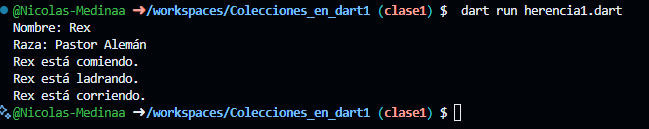

ejemplo de cómo podrías implementar una clase Animal con atributos nombre y raza, y una función comer(). Luego, una clase Perro que hereda de Animal y tiene dos funciones adicionales: ladra() y corre(). Este ejemplo está escrito en Dart:

ejemplo de salida;

